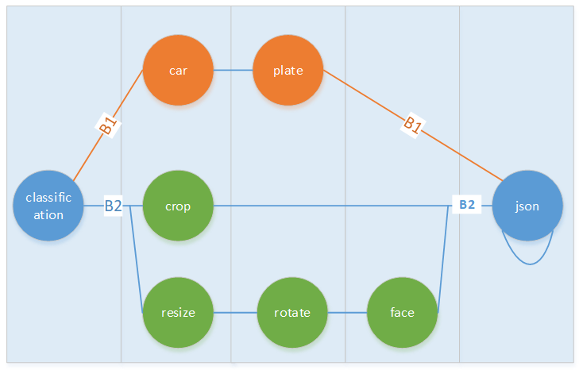
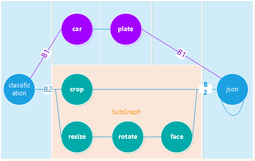

# ModelBox

MODELBOX支持AI业务的快速应用开发，开发人员能通过简单的配置或编码完成AI推理业务的开发工作，并且使业务的运行性能高效，和跨平台、设备运行。  
对华为D芯片能较好的支持，是客户易于使用D芯片能力，在分布式方面也能更容易开发分布式代码。

## 场景

MODELBOX需要支持如下业务场景（挑选部分行业场景）：

行业|解决方案归属|场景说明
--|--|--
智慧城市|数字政府|人群聚集（横幅游行）、占道经营、打架斗殴、烟火检测、共享单车乱摆放等业务场景
园区|智慧园区解决方案|人脸检测、徘徊检测、人流量、热力图等业务场景
高速|智慧高速解决方案|车流、车速、异常事件检测、车脸识别、车辆属性结构化等业务场景
机场|智慧机场解决方案|飞机入离位事件识别、客梯车停靠、撤离识别、客舱门开关识别、餐车配餐开始和结束识别等业务场景
物流|智慧物流解决方案|暴力分拣检测、叉车掉货识别、皮带践踏识别等业务场景
防暴防恐|防暴防恐解决方案|涉黄、涉暴、涉恐、涉政、涉敏识别等业务场景
OCR|OCR解决方案|票据OCR、智能相册、图像搜索等业务场景
互联网|社交|阿联酋G42 Totok类的TTS业务，实现文字转语音，NLP和语音类的业务场景需要对样本进行多次处理

## 目标

### MODELBOX对应的设计目标

1. 动态图/静态图  
MODELBOX支持动态图和静态图:  
`动态图`主要提供python相关的接口，开发人员直接利用python编写AI推理相关的应用，同时可以使用PDB进行推理应用的开发调试。  
`静态图`提供可执行二进制，开发人员可通过图形界面编排AI静态图，和开发相关的流单元，即可实现高性能推理业务的开发工作。  
对于动态图/静态图，支持PDB，GDB在线调式。  

1. 图形化开发推理，一键式发布服务：  
用户在UI界面编排页面通过拖拽方式生成编排静态图文件完成后，一键式将编排业务下发到后台，由后台生成推理服务镜像，并加载对应的编排信息，启动对应的业务。
用户在NodeBook界面使用python调试开发完推理业务成后，一键式将python业务下发到后台，由后台生成推理服务镜像，并加载对应的编排信息，启动对应的业务。

1. 性能监控和跟踪  
`性能监控`：推理流程，对每个步骤进行打点，统计业务的负载，资源占用情况，并将资源在后台展示给用户，同时支持用户配置自动负载均衡策略。  
`profiling`：在开发过程中，支持生成推理业务的profiling文件，对每个执行步骤、流单元的并发度，耗时做采集，并生成profileing文件，UI工具展示采集结果。  

1. 支持平台、异构部署  
支持端、边、云部署；支持IVA， ModelArts，HILens平台；支持GPU，D芯片，ARM，X86等设备。

1. 提高开发调试易用性  
易于调试开发，支持动态图转换为静态图。高效率运行服务。

### 支持特性列表  

| MODELBOX              |                                                           |
| ------------------ | -------------------------------------------------------- |
| 业务场景           | 视频，音频，图片，通用数据                                  |
| 跨平台             | 移动设备（andriod，iOS），边侧设备，嵌入式设备，服务器。      |
| 图形化编排         | 支持模型的串联，支持视频流，音频流，图片等推理                |
| 用户群             | 研究人员，学生，软件开发者                                  |
| 主要业务场景       | 快速完成AI推理业务的开发工作                                 |
| API列表            | C++SDK，JAVA SDK，PYTHON SDK，OBJECT-C SDK                |
| 支持OS             | Linux, andriod，iOS                                       |
| 支持硬件           | CPU, GPU， D芯片                                           |
| 图可视化           | 编辑器可视化图，子图                                        |
| 性能调测           | 性能跟踪。                                                 |
| 循环图，条件       | 支持                                                       |
| 流支持             | 按序号排序                                                 |
| 数据类型检查       | ports概念，ports有类型，构建图的时候校验。                    |
| 数据源节点         | 数据源节点                                                 |
| 汇聚节点           | 数据汇总节点                                               |
| 输入保序           | 按照序号保序                                               |
| 分布式             | 支持分布式图处理，分布式动态调整业务执行                      |
| 编排格式           | Graphviz格式。                                             |
| 一次开发，多处运行  | PYTHON流单元，C++流单元，java流单元。                            |
| 通用流单元覆盖率      | 90%以上的业务场景无需单独写流单元                            |

### 单机编排

提供编排推理开发界面，提供流单元库，通过将流单元库中的流单元连接的方式完成推理编排。  


上述编排例子：  
从OBS中读取数据，调用decoder进行解码，解码后分类，分类为人，自行车，汽车。  
分别对人进行人脸识别，汽车进行车牌识别，自行车进行判断，处理后，将数据上报存储到OBS上。  

每个流单元都可以进行相关的设置，其支持功能列表：  

1. 编排方式创建推理任务。
1. 输入流单元，输出流单元标准化，无需单独开发。
1. 多个流单元可以打包为一个流单元group，外部提供接口。
1. 数据类型检查匹配，对不匹配的数据不能连接图。
1. 自定义流单元加入到编排过程中。
1. 每个流单元的执行策略可进行设置。

流单元开发要求

1. 与大数据结合作为UDF使用、图像处理（matlab/opencv）
1. 流单元完备
1. 流单元开发简单
1. 流单元选择（流单元理解、流单元联想）
1. 流单元打包（集合）

### 性能调测


针对编排的流程，性能统计给出每个流单元，每个步骤的性能统计，运维人员或者开发人员可以对编排进行可视化调优。

### 开发调测

在动态图的情况下，使用Notebook开发业务流程，让用户聚焦于业务开发。

## 接口

### 代码写作样例



上述例子流程：

1. 输入图片，classification对图像分类，
2. 如果图像是car，则走B1分支，识别车牌，并将结果通过json输出。
3. 如果是body，则走B2分支，将图像进行处理，识别人脸，同时输出人脸信息，最后通过json输出。

### 静态图写法

```python
def IsCar(INPUT):
    #分支B1
    if INPUT == CAR:
        return True
    else:
        return False


def IsBody(INPUT):
    #分支B2
    if INPUT == BODY:
        return True
    else:
        return False


def loop_Json(INPUT1, INPUT2, OUTPUT):
    #循环
    if OUTPUT == IS_COMPLETE:
        return False
    return True


def graph():
    # 分类
    classification = flow.Classification(INPUT)

    cpu = modelbox.device("cpu1~20")

    # car的流程，获取车牌
    car = flow.Car(classification, condition_func=IsCar, device=cpu)
    plate = flow.Plate(car)
    json = flow.Json(plate, None, loop_func=loop_Json)

    # 人的流程，采集人脸，识别人脸
    body = flow.Crop(classification, condition_func=IsBody)
    face_resize = flow.Resize(classification, condition_func=IsBody)
    face_rotated = flow.Rotate(face_resize)
    face = flow.Face(face_rotated)
    json = flow.Json(body, face, loop_func=loop_Json)

    #返回json结果
    return json

def runTask():
    # 执行编排并获取结果
    json = flow.Output()
    return json
```

### 动态图写法

```python
def runTask():
    classification = flowunit.Classification(INPUT)
    json_in1 = None
    json_in2 = None

    if classification == CAR:
        # 如果是Car
        car = flowunit.Car(classification)
        json_in1 = flowunit.Plate(car)
        json_in2 = None
    elif classification == BODY:
        # 如果是人
        # 采集人图像
        json_in1 = flowunit.Crop(classification)

        # 人脸识别
        face_resize = flowunit.Resize(classification)
        face_rotated = flowunit.Rotate(face_resize)
        json_in2 = flowunit.Face(face_rotated)
    else:
        return None

    # 循环处理多个结果，组装为json报文
    for in1, in2 in json_in1, json_in2:
        if in1 == DROP or in2 == DROP:
            continue

        json.append(flowunit.Json(in1, in2))

    return json
```

### 配置文件格式

静态图配置文件语法：对应上述的例子，配置文件采用graphviz的DOT语法，或caffe的prototxt格式, 可以在vscode中直接写作DOT。

#### 例子

```graphviz
strict digraph "G" {
    "classfication" [type=flowunit, flowunit=class, device="cpu", deviceid="0"]
    "car" [type=flowunit, flowunit=car_predict, device="gpu", deviceid="1"]
    "plate" [type=flowunit, flowunit=plate_predict, device="gpu", deviceid="2"]

    "crop" [type=flowunit, flowunit=crop]
    "resize" [type=flowunit, flowunit=resize]
    "rotate" [type=flowunit, flowunit=rotate]
    "face" [type=flowunit, flowunit=face_predict]
    "json" [type=flowunit, flowunit=json]

    "has_car" [type=flowunit, flowunit=has_car]
    "has_body" [type=flowunit, flowunit=has_body]


    # 描述关系
    # B1 分支
    "classfication" -> "has_car"  ->"car" -> "plate" -> "json"

    # B2 分支
    "classfication" -> "has_body" -> "crop" -> "json"
    "classfication" -> "has_body" -> "resize" -> "rotate" -> "face" -> "json"

    # 循环
    "json" -> "json" [label="LOOP N=10"]
}
```

具有子图的例子，将B2分支完全放入子图中。



```graphviz
strict digraph "G" {
    # 定义流单元

    "cpu" [type=devices, device=cpu,1~12]
    "gpu1" [type=devices, device=cuda,1]
    "gpu2" [type=devices, device=cuda,2]

    "classfication" [type=flowunit, op=class, device="cpu"]
    "car" [type=flowunit, op=car_predict, device="gpu1"]
    "plate" [type=flowunit, op=plate_predict, device="gpu2"]

    "has_car" [type=control, cond=has_car]
    "has_body" [type=control, cond=has_body]

    # 描述关系
    # B1 分支
    "classfication" -> "has_car"  ->"car" -> "plate" -> "json"

    # B2 分支，采用子图形式
    "classfication" -> "has_car"  ->"has_body" -> "sub:INPUT"
    subgraph "sub" {
        "INPUT" [type=input]
        "OUTPUT" [type=output]

        "crop" [type=flowunit, op=crop]
        "resize" [type=flowunit, op=resize]
        "rotate" [type=flowunit, op=rotate]
        "face" [type=flowunit, op=face_predict]
        "json" [type=flowunit, op=json]

        "INPUT" -> "crop" -> "json"
        "INPUT" -> "has_body" -> "resize" -> "rotate" -> "face" -> "json"

        "json" -> "OUTPUT"
    }
    "sub:OUTPUT" -> "json"

    # 循环
    "json" -> "json" [label="LOOP N=10"]
}
```
